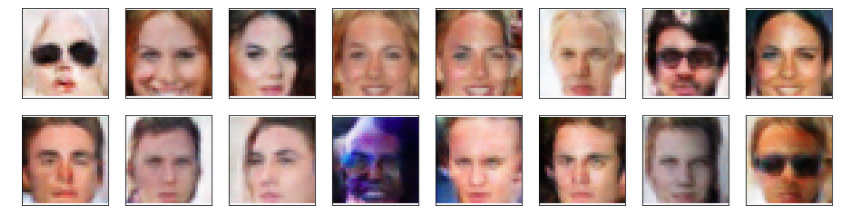

# Generate_Faces

I’m defining and training a DCGAN on a dataset of faces. The goal is to get a generator network to generate new images of faces that look as realistic as possible.

I’m using the CelebFaces Attributes Dataset (CelebA) to train the adversarial networks.
source: http://mmlab.ie.cuhk.edu.hk/projects/CelebA.html

Sample results after only 40 epochs are presented below:



## Project instructions

Please download the learning data from [here](https://s3.amazonaws.com/video.udacity-data.com/topher/2018/November/5be7eb6f_processed-celeba-small/processed-celeba-small.zip) and extract the data into `processed_celeba_small` folder. In alternative uncomment and run the first line in the jupyter notebook:
```ipnbpython
!unzip processed_celeba_small.zip
```
Launch the jupyter notebook server with:
```ipnbpython
jupyter notebook dlnd_face_generation.ipynb
```
